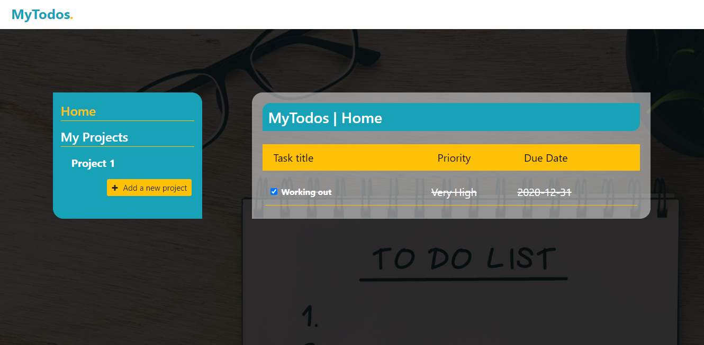

# Todo List


## Description

> Mytodos web app allows users to keep track of their tasks in an easy way. Every user can create different tasks including priority and date. Tasks in Mytodos can be grouped into projects for better organization.

## Library Directory 📙

| Contents                    |
| --------------------------- |
| [Live Demo](#live-demo)     |
| [Screenshot](#screenshot)   |
| [Built With](#built-with-🛠) |
| [Setup](#setup-⏳)          |
| [Testing](#testing-⚙️)      |
| [Authors](#authors)         |
| [License](#license)         |

## Live Demo

[Live demo](https://khalilhamdii.github.io/MyTodos/)

## Screenshot



## Built With 🛠

```
- Javascript
- HTML/CSS
- MDBoostrap
- VS Code
```

## Setup ⏳

> Follow these steps to setup this web application locally :

1. - [ ] Open your `Terminal`.
2. - [ ] Navigate to the directory where you will like to install the repo by running `cd FOLDER-NAME`
3. - [ ] Run `git clone git@github.com:khalilhamdii/MyTodos.git` to download <b>or</b> you can download using `HTTPS` by running `git clone https://github.com/khalilhamdii/MyTodos.git` in the terminal.
4. - [ ] Run `cd MyTodos` to enter directory.
5. - [ ] Run `npm install` to install node packages and dependencies.
6. - [ ] Run `npm run start:dev` to create a local live server.
7. - [ ] Run `http://localhost:8080/` in your browser to start the application.

## Testing ⚙️

> We have used [rspec](https://jestjs.io/) testing tool to test functions by creating several test cases. Please follow below steps to run Jest testing tool:

1. - [ ] Open `Terminal` again
2. - [ ] Run `cd MyTodos` to enter directory
3. - [ ] Run `npm run test` to start testing
4. - [ ] All tests will pass ✅

## Authors

### 👨‍💻 Khalil Hamdi

[](https://github.com/khalilhamdii) <br>
[](https://www.linkedin.com/in/khalilhamdi/) <br>
[](mailto:khaalil.hamdi@gmail.com) <br>
[](https://twitter.com/Khalilhamdiii)

### 👨‍💻 NTWALI Heritier

[](https://github.com/NtwaliHeritier) <br>
[](https://www.linkedin.com/in/ntwaliheritier/) <br>
[](mailto:ntwalihatsor78.nh@gmail.com) <br>
[](https://twitter.com/NtwaliHeritier)

### 🤝 Contributing

Contributions, issues and feature requests are welcome!

Feel free to check the [issues page](https://github.com/khalilhamdii/MyTodos).

### Show your support

Give a ⭐️ if you like this project!

### License


